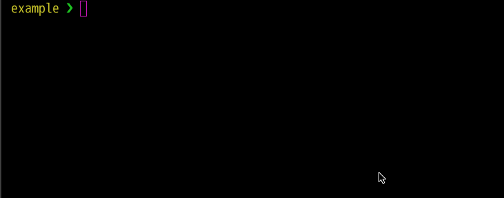

# 30days-plank β

This is a personal application for managing my 30 days plank challenge.  
You can use this application, but it may be discontinued without notice :bow:  
(I hope this project won't end in a short time for my health :sweat_smile:)

> CAUTION: You may need to add a 3rd party cookie settings.  
> In order for you to sign-in to this application, you may need to add a 3rd party cookie settings.
>
> `e.g. Chrome`: Please add `thirty-days-plank-v1.firebaseapp.com` to `site settings` > `Cookies and site data` > `Allow` in settings

## Development environment

- `node >= 10.16.0`
- `yarn >= 1.17.0`
- Set up your Firebase project (required)
  - Firebase Authentication (Provider Google)
  - Cloud Firestore

### Set up a development environment

**First step**

```
git@github.com:nagomu/30days-plank.git
cd ./30days-plank
yarn
```

**Set environment variables**

```
cp .env.example .env
vi .env
```

**Start dev server**

```
yarn dev
# => http://localhost:8080

# Test
yarn test

# Lint (stylelint's autofix does not work)
yarn lint:fix
```

### Misc

If you want to add icons, add those into `src/assets/icons`.  
then, add those name to `src/components/common/icons/Icon.tsx` .

You can use [`Hygen`](https://www.hygen.io/).



## Contributing

This is a personal project. So, Basically I recommend you fork this repository.  
However, I'm very happy that you contributed through code reviews, new feature ideas and UI improvements.
